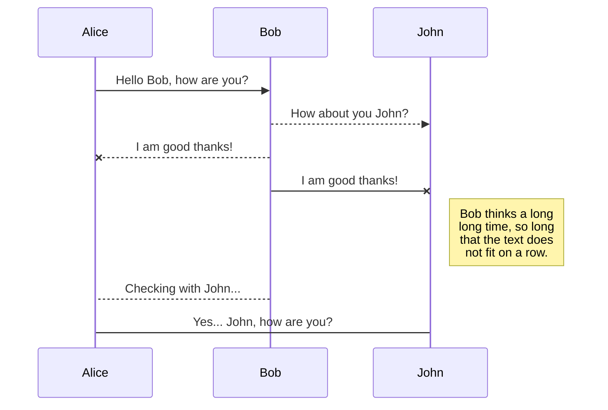
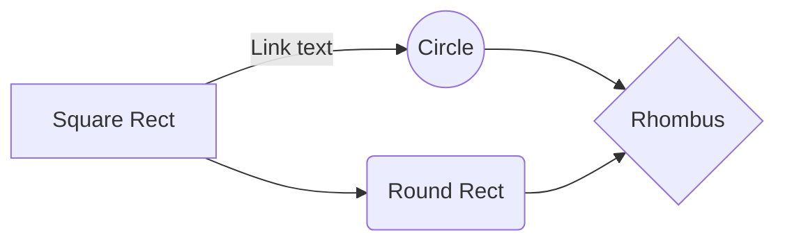

# Python Programming II (Final Project)

This is the readme.md file for Python Programming II (Final Project).  Our final project is a device management system, and is going to contain two layers, cli and gui.  

# Team

Tyson and Blake

## Device Management System

The Device Management System is written in python programming language.  The python program primarily contains two layers, cli and gui.  The cli is for the admin to create, read, update, and delete device records.  The gui is for the user to read device records.

## CLI (command line interface)

Upon running the python program through the command line interface, the admin user will be presented with a main menu.   The main menu will give the admin user options to create a device record, read or search a device record, update a device record, and delete a record.

## GUI (tkinter)

Upon running the python program to launch the tkinter gui, the user will have options to view device records in a read only mode.

## Database backend (SQLite)

The database backend for this project will be SQLite.  When the admin user creates a record, the record will be stored, processed, and edited using the SQLite database. 

## Fields for the records

The **unique id** for the record is **id** the datatype is **integer**, we also include the following records and corresponding **datatypes**:

1. ID = integer (primary key) (unique id)
2. Serial = string
3. Mac = string
4. Tag_Num = integer
5. Make = string
6. Model = string
7. Factory_Reset = Boolean 

# Communication

This area is for communication between Tyson and Blake.  We will keep a **team member**, a **date**, a **time**, and a **comment** for each log entry.  To uptain formatting standards, we will also show our **newest** log entries at the **top**, and **oldest** entries at the **bottom**.

**Team Member:** Tyson  
**Date:** 11/28/23  
**Time:**  11:13 pm  
**Comment:** Created the CLI python Code version 1.0. txt file  
 

**Team Member:** Blake  
**Date:** 11/27/23  
**Time:**  11:42 am  
**Comment:** Created the readme.md file  
 

## Table file format

|                |ASCII                          |HTML                         |
|----------------|-------------------------------|-----------------------------|
|Single backticks|`'Isn't this fun?'`            |'Isn't this fun?'            |
|Quotes          |`"Isn't this fun?"`            |"Isn't this fun?"            |
|Dashes          |`-- is en-dash, --- is em-dash`|-- is en-dash, --- is em-dash|

## UML diagrams

You can render UML diagrams using [Mermaid](https://mermaidjs.github.io/). For example, this will produce a sequence diagram:

And this will produce a flow chart:

